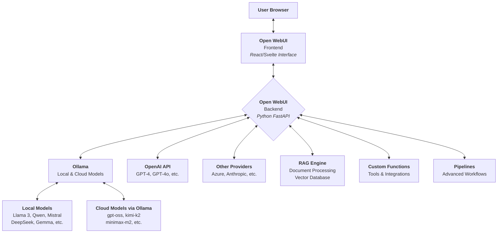
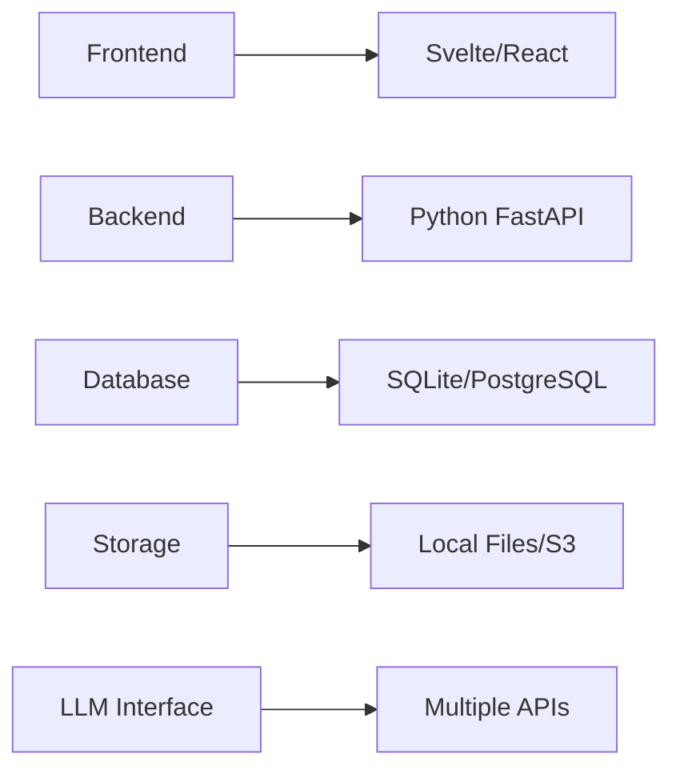
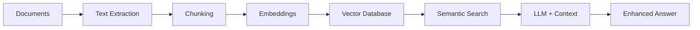
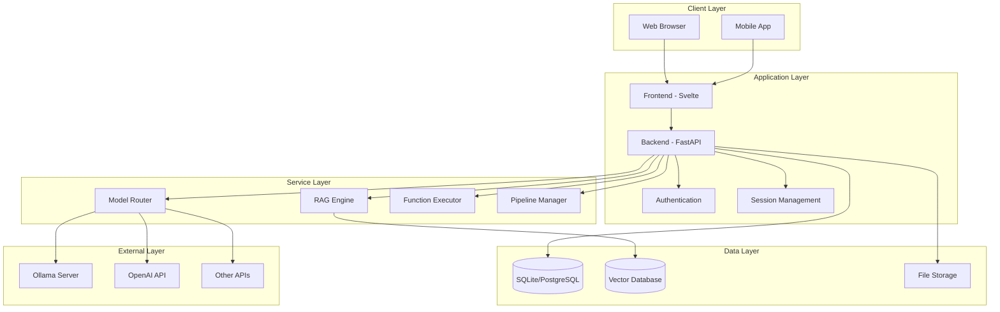
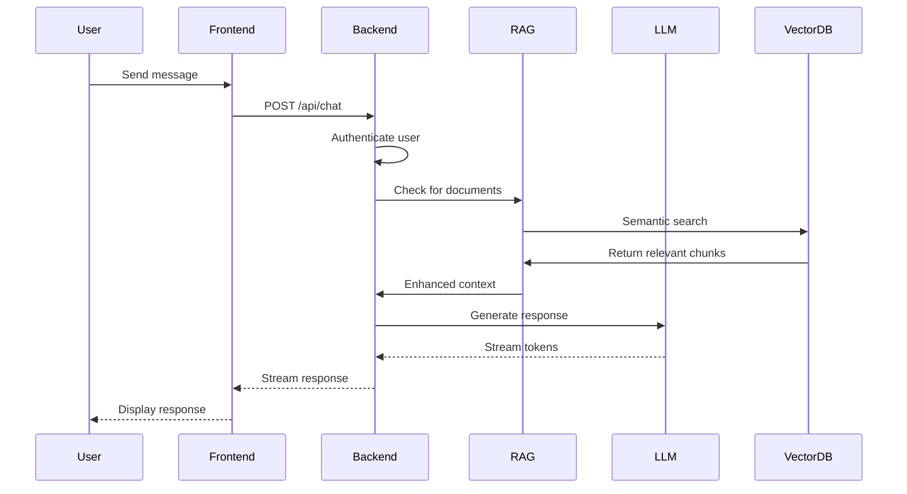
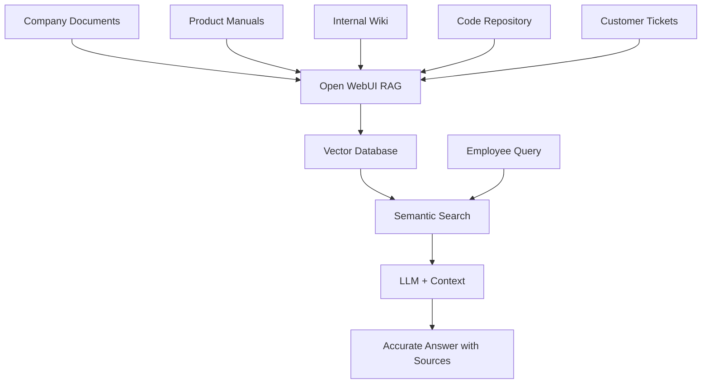
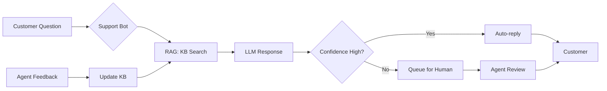
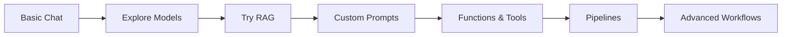

# Introduction to Open WebUI

[](https://github.com/open-webui/open-webui) [](http://creativecommons.org/licenses/by-sa/4.0/)

A comprehensive guide to understanding Open WebUI, the extensible and feature-rich web interface for interacting with Large Language Models (LLMs).

---

## Table of Contents

1. [What is Open WebUI?](#what-is-open-webui)
2. [How Open WebUI Works](#how-open-webui-works)
3. [Key Features and Strengths](#key-features-and-strengths)
4. [Architecture Overview](#architecture-overview)
5. [Use Cases and Examples](#use-cases-and-examples)
6. [Comparison with Other Solutions](#comparison-with-other-solutions)
7. [Community and Ecosystem](#community-and-ecosystem)
8. [Getting Started](#getting-started)
9. [Useful Links and Resources](#useful-links-and-resources)

---

<a id="what-is-open-webui"></a>

## What is Open WebUI?

**Open WebUI** is an extensible, feature-rich web user interface designed for interacting with Large Language Models (LLMs). It acts as a powerful, self-hosted alternative to interfaces like OpenAI's ChatGPT, Google's Gemini, or Anthropic's Claude.

Originally known as **Ollama WebUI**, Open WebUI has evolved into a comprehensive platform that supports multiple LLM backends, not just Ollama. It provides users with complete control over their AI interactions while maintaining privacy and offering extensive customization options.

### Core Concepts

- **Self-hosted:** Run entirely on your own infrastructure, ensuring data privacy and control
- **Offline-capable:** Works without an internet connection when using local models
- **Multi-backend support:** Connect to Ollama, OpenAI, Azure, Anthropic, and other compatible APIs
- **Extensible:** Plugin system, custom functions, and pipeline support for advanced workflows
- **User-friendly:** Modern, intuitive interface resembling popular commercial AI chat platforms

### Who Is Open WebUI For?

- **Privacy-conscious users** who want to keep their data local
- **Developers** building AI-powered applications or experimenting with LLMs
- **Researchers** conducting AI experiments with full control over parameters
- **Enterprises** needing on-premises AI solutions with security and compliance
- **Enthusiasts** exploring the capabilities of open-source AI models
- **Teams** collaborating on AI-assisted projects with shared resources

---

<a id="how-open-webui-works"></a>

## How Open WebUI Works

Open WebUI acts as a bridge between users and various LLM providers. It offers a unified interface regardless of the backend model or API you're using.



### Workflow Explanation

1. **User Interaction:** Users interact with Open WebUI through a web browser
2. **Frontend Processing:** The frontend handles the UI/UX and sends requests to the backend
3. **Backend Routing:** The backend determines which LLM provider to use based on user selection
4. **Model Execution:** The request is sent to the appropriate backend (Ollama, OpenAI, etc.)
5. **Response Delivery:** The model's response is streamed back through the backend to the frontend
6. **Enhancement:** Optional features like RAG, functions, or pipelines can augment the interaction

### Technical Stack



---

<a id="key-features-and-strengths"></a>

## Key Features and Strengths

Open WebUI stands out due to its comprehensive feature set and flexibility. Here are the main strengths:

### 1. **Privacy and Data Control**

- **Self-hosted:** Your conversations and data never leave your infrastructure
- **Offline mode:** Use local models without any internet connection
- **No telemetry:** Complete control over data collection and usage
- **GDPR compliant:** Full data sovereignty for enterprises

### 2. **Multi-Backend Support**

Connect to multiple LLM providers simultaneously:

| Provider     | Type                  | Examples                                |
| ------------ | --------------------- | --------------------------------------- |
| Ollama       | Local/Cloud           | Llama 3, Mistral, DeepSeek, Qwen, Gemma |
| OpenAI       | Cloud API             | GPT-4, GPT-4o, GPT-3.5                  |
| Azure OpenAI | Enterprise Cloud      | GPT-4, Custom models                    |
| Anthropic    | Cloud API             | Claude 3.5 Sonnet, Claude 3 Opus        |
| Google       | Cloud API             | Gemini Pro, Gemini Ultra                |
| Cohere       | Cloud API             | Command, Command-R+                     |
| Custom APIs  | Any OpenAI-compatible | LocalAI, Text Generation WebUI, etc.    |

### 3. **Advanced RAG (Retrieval-Augmented Generation)**

Built-in document processing and knowledge base integration:



**Supported document types:**

- PDF, DOCX, TXT, MD
- CSV, XLSX (spreadsheets)
- Images (with vision models)
- Web pages (via URL)
- Code files

### 4. **User Management and Collaboration**

- **Multi-user support:** Create accounts for teams
- **Role-based access control:** Admin, user, and custom roles
- **Shared conversations:** Collaborate on AI interactions
- **Workspace organization:** Separate projects and contexts
- **Usage tracking:** Monitor model usage and costs

### 5. **Extensive Customization**

- **Custom prompts:** Create and share prompt templates
- **Model parameters:** Fine-tune temperature, top-p, frequency penalty, etc.
- **UI themes:** Light, dark, and custom color schemes
- **Language support:** Multi-language interface
- **Custom functions:** Integrate external tools and APIs

### 6. **Developer-Friendly**

- **API access:** REST API for programmatic interactions
- **Plugin system:** Extend functionality with custom plugins
- **Pipeline support:** Create complex AI workflows
- **Webhook integration:** Connect to external services
- **OpenAPI compatible:** Easy integration with existing tools

### 7. **Modern User Experience**

- **Markdown support:** Rich text formatting in conversations
- **Code highlighting:** Syntax highlighting for multiple languages
- **Image generation:** Integration with DALL-E, Stable Diffusion, etc.
- **Voice input/output:** Speech-to-text and text-to-speech
- **Mobile responsive:** Works seamlessly on phones and tablets
- **Conversation management:** Search, tag, and organize chats
- **Export options:** Download conversations in various formats

### 8. **Performance and Efficiency**

- **Streaming responses:** Real-time token generation display
- **Model switching:** Change models mid-conversation
- **Context management:** Smart context windowing for long conversations
- **Caching:** Reduce redundant API calls
- **Load balancing:** Distribute requests across multiple instances

---

<a id="architecture-overview"></a>

## Architecture Overview

### System Components

The architecture of Open WebUI is based on several interconnected components. The frontend (user interface) is a modern web application that communicates with the backend via a REST API. The backend, written in Python, manages business logic and authentication, and orchestrates requests to the various language models.
The Database stores user information, conversations, configurations, and system settings. It typically uses SQLite for simple installations or PostgreSQL for production deployments.
The Vector Database is used specifically for RAG (Retrieval-Augmented Generation) features. It stores embeddings of uploaded documents, enabling fast semantic searches during user queries.
LLM APIs (Ollama, OpenAI, etc.) are the different language model providers that the user can select. The Backend acts as an intelligent proxy that routes requests to the appropriate model.



### Data Flow for a Typical Request

When a user sends a message, here is the typical data flow:

User Browser → Frontend: The user types their message into the interface.
Frontend → Backend: The message is sent via an HTTP/WebSocket request with the authentication token.
Backend → Database: The backend checks permissions, retrieves the conversation history, and saves the new message.
Backend → Vector Database (if RAG enabled): Searches for relevant documents based on the request
Backend → LLM API: The backend builds the context (history + RAG documents) and sends the request to the selected model
LLM API → Backend: The model generates a response, often via streaming
Backend → Frontend: The response is transmitted to the interface, potentially in real time via WebSocket
Backend → Database: The response is saved in the conversation history
Frontend → User: The user sees the response gradually appear

This flow may vary depending on the features enabled (plugins, RAG, multi-modal, etc.), but represents the standard use case for a simple conversation.



---

<a id="use-cases-and-examples"></a>

## Use Cases and Examples

### 1. **Personal AI Assistant**

Replace commercial AI services with a private alternative.

**Example workflow:**

- **Morning briefing:** Ask about today's schedule, weather, and news
- **Research assistance:** Query your personal document library
- **Writing help:** Draft emails, articles, or code with custom models
- **Learning companion:** Interactive tutoring on any subject

**Benefits:**

- All data stays on your device
- No subscription fees
- Use multiple models for different tasks
- Access even without internet (with local models)

---

### 2. **Team Collaboration Platform**

Enable teams to work together with AI assistance.

**Example scenario:**

```
Team: Software Development (5 members)
Setup: Self-hosted Open WebUI on company server

Use cases:
- Code review assistance with DeepSeek Coder
- Documentation generation with GPT-5
- Bug analysis with local Qwen model
- Architecture discussions with Claude 4.5
- Shared prompt library for common tasks
```

**Features utilized:**

- Multi-user accounts with different permissions
- Shared conversations and prompt templates
- RAG with company documentation
- Custom functions for code analysis tools

---

### 3. **Research and Experimentation**

Test and compare different models for academic or commercial research.

**Example workflow:**

| Task                    | Model Used     | Parameters | Result Quality      |
| ----------------------- | -------------- | ---------- | ------------------- |
| Legal document analysis | Llama 3 70B    | Temp: 0.2  | High accuracy       |
| Creative writing        | Mistral Large  | Temp: 0.9  | Very creative       |
| Code generation         | DeepSeek Coder | Temp: 0.3  | Clean, working code |
| General Q&A             | GPT-4o         | Temp: 0.5  | Well-balanced       |

**Advantages:**

- Compare responses from multiple models side-by-side
- Track model performance metrics
- Fine-tune parameters for optimal results
- Maintain research logs and conversation history

---

### 4. **Enterprise Knowledge Base**

Build an AI-powered knowledge management system.

**Setup example:**



**Use cases:**

- Employee onboarding assistance
- Technical support automation
- Policy and procedure queries
- Product information retrieval
- Code documentation search

---

### 5. **Content Creation Workflow**

Streamline content production with AI assistance.

**Example pipeline:**

1. **Brainstorming:** Use Claude 3.5 with high temperature for ideas
2. **Outline creation:** Switch to GPT-4 for structured planning
3. **Writing:** Use local Llama 3 for privacy-sensitive content
4. **Editing:** GPT-4o for grammar and style improvements
5. **SEO optimization:** Custom function to analyze keywords

**Custom function example:**

```python
# SEO Analysis Function
def analyze_seo(content):
    # Extract keywords
    # Check readability score
    # Suggest improvements
    # Return structured data
```

---

### 6. **Developer Productivity Tool**

Enhance development workflows with AI coding assistance.

**Typical use cases:**

| Task          | Command/Prompt                              | Model          |
| ------------- | ------------------------------------------- | -------------- |
| Debug code    | "Find bugs in this Python function"         | DeepSeek Coder |
| Write tests   | "Generate unit tests for this class"        | GPT-4o         |
| Explain code  | "Explain this algorithm step by step"       | Claude 4.5     |
| Refactor      | "Refactor this code for better performance" | Qwen Coder     |
| Documentation | "Write docstrings for these functions"      | Llama 3        |

**Integration options:**

- Use API to integrate with VS Code
- Create custom functions for Git operations
- Pipeline for code review automation
- RAG with project documentation

---

### 7. **Educational Platform**

Create personalized learning experiences.

**Example implementation:**

```
Student Portal powered by Open WebUI

Features:
- Personalized tutoring with adapted difficulty
- Interactive problem-solving sessions
- Multi-language support for international students
- Progress tracking across conversations
- Custom prompt templates for different subjects
```

**Subject-specific models:**

- Mathematics: Use models fine-tuned for step-by-step reasoning
- Languages: Leverage multilingual models like Qwen
- Programming: DeepSeek Coder for coding tutorials
- Writing: Claude for essay feedback

---

### 8. **Customer Support Automation**

Build intelligent support systems with human-in-the-loop.

**Architecture:**



**Benefits:**

- Handle routine questions automatically
- Maintain context across conversation
- Learn from human agent corrections
- Provide consistent answers
- Scale support without proportional headcount

---

<a id="comparison-with-other-solutions"></a>

## Comparison with Other Solutions

### Open WebUI vs. Alternatives

| Feature                   | Open WebUI      | ChatGPT Web            | Ollama CLI      | Text Gen WebUI  |
| ------------------------- | --------------- | ---------------------- | --------------- | --------------- |
| **Multi-backend support** | ✅ Excellent     | ❌ No                   | ⚠️ Ollama only  | ⚠️ Limited      |
| **Self-hosted**           | ✅ Yes           | ❌ No                   | ✅ Yes           | ✅ Yes           |
| **User management**       | ✅ Yes           | ⚠️ Limited             | ❌ No            | ❌ No            |
| **RAG built-in**          | ✅ Yes           | ⚠️ Paid only           | ❌ No            | ⚠️ Plugin       |
| **UI/UX quality**         | ✅ Excellent     | ✅ Excellent            | ❌ CLI only      | ⚠️ Good         |
| **Mobile support**        | ✅ Responsive    | ✅ Native app           | ❌ No            | ⚠️ Limited      |
| **API access**            | ✅ Yes           | ✅ Yes (paid)           | ✅ Yes           | ✅ Yes           |
| **Custom functions**      | ✅ Yes           | ⚠️ Limited             | ❌ No            | ⚠️ Limited      |
| **Cost**                  | 🆓 Free         | 💰 Freemium            | 🆓 Free         | 🆓 Free         |
| **Privacy**               | 🔒 Full control | ⚠️ Data sent to OpenAI | 🔒 Full control | 🔒 Full control |

### When to Choose Open WebUI

**Choose Open WebUI if you:**

- ✅ Need privacy and data control
- ✅ Want to use multiple LLM providers
- ✅ Require multi-user support
- ✅ Need RAG capabilities out-of-the-box
- ✅ Want a modern, ChatGPT-like interface
- ✅ Need extensive customization options
- ✅ Are building for enterprise deployment
- ✅ Want both local and cloud model support

**Consider alternatives if you:**

- ❌ Want zero setup (use ChatGPT web)
- ❌ Only need simple, single-user CLI (use Ollama CLI)
- ❌ Need advanced model fine-tuning UI (use Text Gen WebUI)
- ❌ Don't have hosting infrastructure

---

<a id="community-and-ecosystem"></a>

## Community and Ecosystem

### Active Development

Open WebUI is actively maintained with regular updates and new features.

**Project stats:**

- 🌟 50,000+ GitHub stars
- 🔄 Weekly updates
- 🐛 Responsive issue tracking
- 💬 Active Discord community
- 📚 Comprehensive documentation

### Plugin Ecosystem

Extend Open WebUI with community plugins:

**Popular plugin categories:**

- **Integrations:** Slack, Discord, Telegram bots
- **Data sources:** Google Drive, Notion, Confluence
- **Tools:** Web search, calculator, code execution
- **Models:** Custom model loaders and adapters
- **UI enhancements:** Custom themes, widgets

### Contribution Opportunities

The project welcomes contributions:

- 🐛 Bug reports and fixes
- ✨ Feature requests and implementations
- 📖 Documentation improvements
- 🌍 Translations and localization
- 🎨 UI/UX enhancements
- 🔌 Plugin development

---

<a id="getting-started"></a>

## Getting Started

### Prerequisites

Before diving in, ensure you have:

- **For local models:** Sufficient hardware (GPU recommended for larger models)
- **For cloud models:** API keys for your chosen providers
- **Basic knowledge:** Familiarity with Docker or Python environments
- **Network:** Internet connection for initial setup and cloud models

### First Steps

Once Open WebUI is installed (covered in separate tutorials), here's how to begin:

1. **Access the interface:** Open your browser and navigate to the Open WebUI URL
2. **Create an account:** The first user automatically becomes the admin
3. **Configure a model backend:** Add Ollama or API credentials
4. **Start chatting:** Select a model and begin your first conversation
5. **Explore features:** Try RAG, custom prompts, and other capabilities

### Learning Path



**Recommended progression:**

1. **Week 1:** Get comfortable with basic conversations
2. **Week 2:** Experiment with different models and parameters
3. **Week 3:** Upload documents and test RAG capabilities
4. **Week 4:** Create custom prompts for your use cases
5. **Month 2+:** Explore advanced features, functions, and pipelines

### Best Practices

- **Start simple:** Begin with cloud models or smaller local models
- **Document your prompts:** Save successful prompt patterns
- **Experiment:** Try different models for different tasks
- **Organize:** Use tags and folders for conversation management
- **Share knowledge:** Contribute to the community with your findings

---

<a id="useful-links-and-resources"></a>

## Useful Links and Resources

### Official Resources

- **🏠 Official Website:** [https://openwebui.com](https://openwebui.com/)
- **📦 GitHub Repository:** [https://github.com/open-webui/open-webui)](https://github.com/open-webui/open-webui)
- **📖 Documentation:** [https://docs.openwebui.com](https://docs.openwebui.com/)
- **💬 Discord Community:** [https://discord.gg/open-webui](https://discord.gg/open-webui)
- **🐥 Reddit Community:** [https://www.reddit.com/r/OpenWebUI/](https://www.reddit.com/r/OpenWebUI/)
- **🐛 Issue Tracker:** [https://github.com/open-webui/open-webui/issues](https://github.com/open-webui/open-webui/issues)

### Related Projects

- **🦙 Ollama:** [https://ollama.ai](https://ollama.ai/)
- **🐳 Docker:** [https://www.docker.com](https://www.docker.com/) - Containerization

### Model Resources

- **Ollama Models:** [https://ollama.ai/library](https://ollama.ai/library)
- **OpenAI Models:** [https://platform.openai.com/docs/models](https://platform.openai.com/docs/models)
- **Anthropic Models:** [https://www.anthropic.com/claude](https://www.anthropic.com/claude)
- **Open Source Models:** [https://huggingface.co](https://huggingface.co/)

---

## Conclusion

Open WebUI represents a powerful, flexible, and privacy-focused approach to interacting with Large Language Models. Whether you're a solo developer, part of a team, or managing enterprise deployments, Open WebUI provides the tools and flexibility to create AI-powered workflows that meet your specific needs.

**Key Takeaways:**

- 🔒 **Privacy-first:** Full control over your data
- 🎯 **Flexible:** Support for multiple backends and use cases
- 🚀 **Feature-rich:** RAG, functions, pipelines, and more
- 👥 **Collaborative:** Multi-user support for teams
- 🆓 **Open source:** Free, with an active community
- 📈 **Scalable:** From personal use to enterprise deployments

The future of AI interaction is open, customizable, and in your control. Open WebUI makes that future accessible today.

---

## 📄 License

[](http://creativecommons.org/licenses/by-sa/4.0/)
This textual content is licensed under CC BY-SA 4.0.

## 👤 Author

**Rex Nihilo**

- GitHub: [@rex-nihilo](https://github.com/rex-nihilo)
- Project: [Open WebUI Toolkit](https://github.com/rex-nihilo/open-webui-toolkit)
- OpenWebUI: [@rexnihilo](https://openwebui.com/u/rexnihilo)
- Website: [https://rexnihilo.com](https://rexnihilo.com)

## 💖 Support

If you find this work helpful:

- ⭐ Star the repository
- 📢 Share with other developers

---

**Licence:** [CC BY-SA 4.0](http://creativecommons.org/licenses/by-sa/4.0/) | **Last updated:** November 2025 by **Rex Nihilo**
